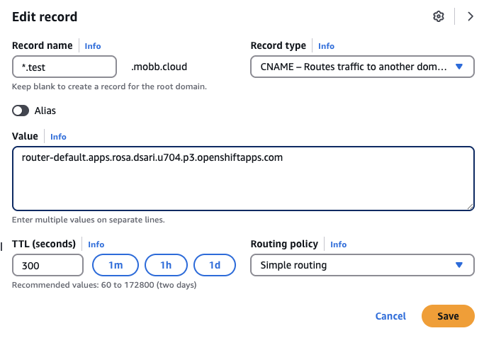

This is a simple guide to integrate [Red Hat OpenShift Service Mesh](https://www.redhat.com/en/technologies/cloud-computing/openshift/what-is-openshift-service-mesh) into your ROSA cluster. In this scenario, we will install Service Mesh 2 using a custom domain (optional) and expose an app to test it.  


### 1. Prerequisites

* A [classic](https://cloud.redhat.com/experts/rosa/terraform/classic/) or [HCP](https://cloud.redhat.com/experts/rosa/terraform/hcp/) ROSA cluster v4.14 and above.
* The oc CLI      # logged in.
* (optional) A Public Route 53 Hosted Zone, and the related Domain to use.
* An app to expose (alternatively, we will be creating a simple **Hello OpenShift** app in this guide)


### 2. Set up environment

Install the necessary operators, i.e. Elasticsearch (optional), Jaeger (distributed tracing platform), Kiali, and Service Mesh 2, from OpenShift console. 

Then log into your cluster via CLI and set up the following environment variables.

```bash
APP_NAMESPACE=my-public-app # change this to your app namespace if you have one already
DOMAIN=test.mobb.cloud  # change this to your custom domain
```

### 3. Create the Service Mesh Control Plane

[Service Mesh Control Plane](https://docs.redhat.com/en/documentation/openshift_container_platform/4.18/html/service_mesh/service-mesh-2-x#ossm-about-smcp_ossm-create-smcp) is the central management component that configures and controls the entire mesh, including traffic management, security, and observability features.

```bash
cat << EOF | oc apply -f -
apiVersion: maistra.io/v2
kind: ServiceMeshControlPlane
metadata:
  name: basic
  namespace: istio-system
spec:
  version: v2.6
  security:
    identity:
      type: ThirdParty
  tracing:
    type: Jaeger
    sampling: 10000
  addons:
    jaeger:
      name: jaeger
      install:
        storage:
          type: Memory
    kiali:
      enabled: true
      name: kiali
    grafana:
      enabled: true
EOF
```

### 4. Create the Service Mesh Member Roll

[Service Mesh Member Roll](https://docs.redhat.com/en/documentation/openshift_container_platform/4.18/html/service_mesh/service-mesh-2-x#ossm-member-roll-create_ossm-create-mesh) is a resource that defines which namespaces are part of the mesh and will have Istio functionality applied to them.

```bash
cat << EOF | oc apply -f -
apiVersion: maistra.io/v1
kind: ServiceMeshMemberRoll
metadata:
  name: default
  namespace: istio-system
spec:
  members:
  - $APP_NAMESPACE
EOF
```

### 5. Configure namespace for mesh injection

Mesh injection is the process of annotating a namespace to automatically inject the Istio sidecar proxy into all pods created in that namespace.

```bash
cat << EOF | oc apply -f -
apiVersion: v1
kind: Namespace
metadata:
  name: $APP_NAMESPACE
  annotations:
    maistra.io/inject: "true"
EOF
```

### 6. Deploy Hello OpenShift app (optional)

Skip this step if you have already created an app.

```bash
oc new-project $APP_NAMESPACE
oc new-app --docker-image=docker.io/openshift/hello-openshift
```

### 7. Add sidecar injection to deployment

Sidecar injection is the deployment of an Envoy proxy container alongside your application container to intercept and manage all network traffic

```bash
cat << EOF | oc apply -f -
apiVersion: apps/v1
kind: Deployment
metadata:
  name: hello-openshift
  namespace: $APP_NAMESPACE
spec:
  template:
    metadata:
      annotations:
        sidecar.istio.io/inject: "true"
EOF
```

Then restart deployment to trigger sidecar injection:

```bash
oc rollout restart deployment/hello-openshift -n $APP_NAMESPACE
```

And verify pods have sidecars (should show 2/2 ready):

```bash 
oc get pods -n $APP_NAMESPACE
```

### 8. Create Istio Gateway

Istio Gateway is a load balancer operating at the edge of the mesh that manages inbound and outbound HTTP/TCP connections.

```bash
cat << EOF | oc apply -f -
apiVersion: networking.istio.io/v1beta1
kind: Gateway
metadata:
  name: hello-gateway
  namespace: $APP_NAMESPACE
spec:
  selector:
    istio: ingressgateway
  servers:
  - port:
      number: 80
      name: http
      protocol: HTTP
    hosts:
    - "hello.$DOMAIN"
EOF
```

### 9. Create Virtual Service

Virtual Service is a traffic routing rule that defines how requests sent to a service are routed within the mesh, enabling fine-grained traffic control.

```bash
cat << EOF | oc apply -f -
apiVersion: networking.istio.io/v1beta1
kind: VirtualService
metadata:
  name: hello-vs
  namespace: $APP_NAMESPACE
spec:
  hosts:
  - "hello.$DOMAIN"
  gateways:
  - hello-gateway
  http:
  - route:
    - destination:
        host: hello-openshift
        port:
          number: 8080
EOF
```

### 10. Create OpenShift Route to Istio Ingress Gateway

In the context of Service Mesh, OpenShift Route is a way to expose the Istio Ingress Gateway to external traffic using OpenShift's built-in routing layer.

```bash
cat << EOF | oc apply -f -
apiVersion: route.openshift.io/v1
kind: Route
metadata:
  name: hello-mesh
  namespace: istio-system
spec:
  host: hello.$DOMAIN
  to:
    kind: Service
    name: istio-ingressgateway
  port:
    targetPort: http2
  tls:
    termination: edge
    insecureEdgeTerminationPolicy: Redirect
EOF
```

### 11. Configure custom domain (optional)

If you're using custom domain, then go to AWS Console and change the record to point to the route hostname.

Get your canonical route hostname:

```bash
oc get route hello-mesh -n istio-system -o jsonpath='{.status.ingress[0].routerCanonicalHostname}'
```

This should give you an output like `router-default.apps.rosa.your-cluster-name.xxxx.px.openshiftapps.com`. Use this as the value of your domain.


<br />


### 12. Verify the setup and access your application

Check if ingress gateway is running:

```bash
oc get pods -n istio-system | grep ingressgateway
```

Access your application by testing the route:

```bash
curl -k https://hello.$DOMAIN
```

You should see the output `Hello OpenShift!`. 

> **Note**: If you are accessing your browser, you might get **Not Secure** warning due to certificate mismatch. Since this is a testing environment, you can safely ignore this. However, for production environment, you might want to use a custom certificate for your route, or use Let's Encrypt with OpenShift's cert-manager, for example. 